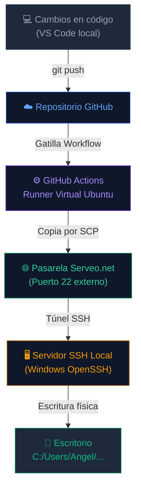
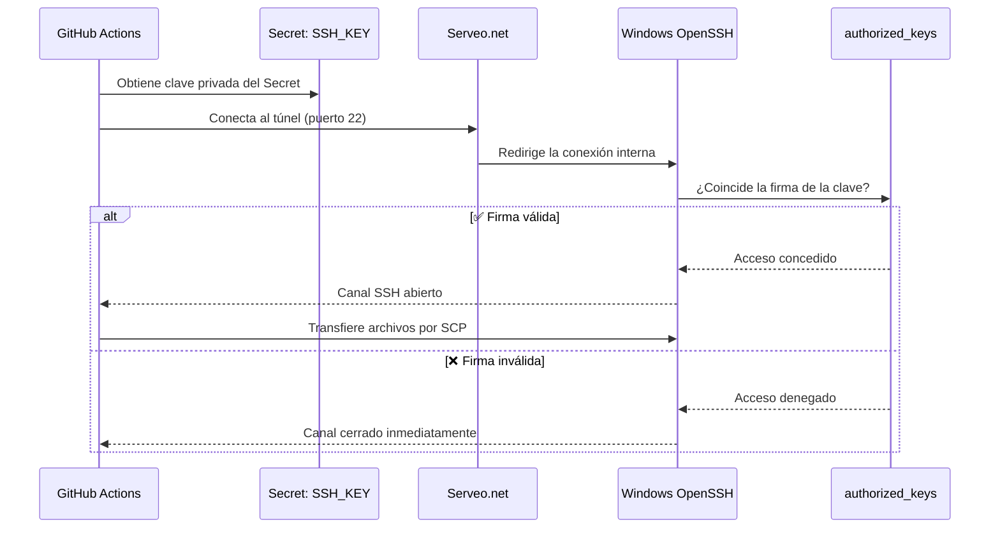
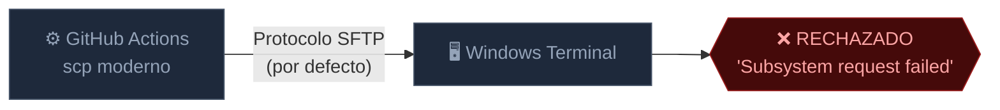
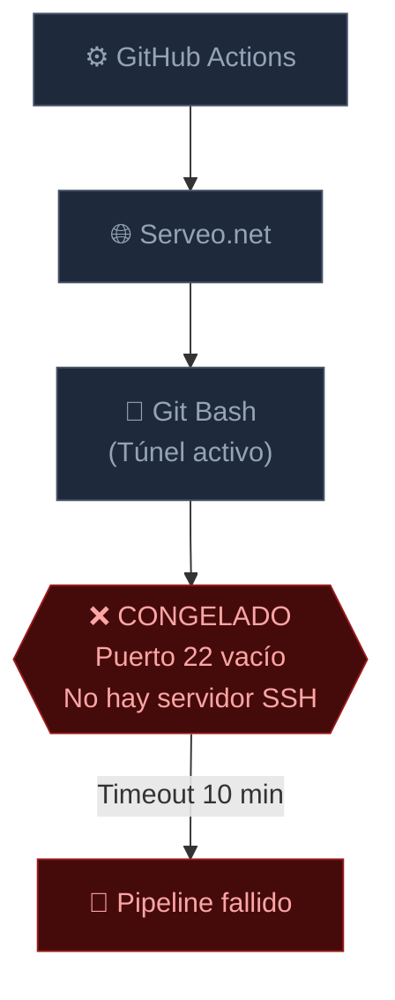
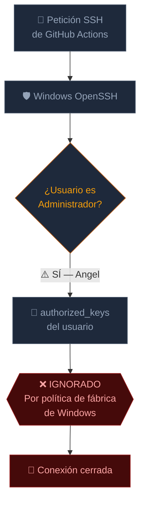

# 🚀 CI/CD Pipeline — Documentación Visual de Arquitectura & Troubleshooting

> Manual del pipeline automatizado de **Integración y Despliegue Continuo** que transporta código desde GitHub hasta el entorno local en Windows.

---

## 📁 1. Estructura del Proyecto

```text
MI-WEB-CICD-TEST/
├── .github/
│   └── workflows/
│       └── deploy.yml          ← Configuración del pipeline (YAML)
├── node_modules/               ← Dependencias Node.js (excluidas de Git)
├── index.html                  ← Frontend principal
├── styles.css                  ← Estilos de diseño
├── script.js                   ← Lógica del cliente
├── server.js                   ← Servidor backend local
├── package.json                ← Manifiesto del proyecto
├── package-lock.json           ← Bloqueo de versiones
└── README.md                   ← Este archivo
```

---

## 🗺️ 2. Flujo General del Pipeline

Recorrido completo del código desde el commit hasta el escritorio local.



---

## 🔒 3. Flujo de Autenticación SSH

Cómo se valida la identidad antes de permitir la escritura en disco.



---

## 🧠 4. Diagnóstico de Fallas Críticas

### ❌ Falla 1 — Incompatibilidad de Protocolo SCP

El cliente `scp` moderno usa SFTP por defecto, pero el subsistema SFTP no estaba activo en Windows.


---

### ❌ Falla 2 — El Vacío del Puerto 22 (Timeout de 10 minutos)

El túnel existía, pero no había servidor SSH en Windows escuchando internamente.


---

### ❌ Falla 3 — Bloqueo por Cuenta Administradora

Windows OpenSSH ignora por seguridad las `authorized_keys` de usuarios del grupo Administradores.


---
